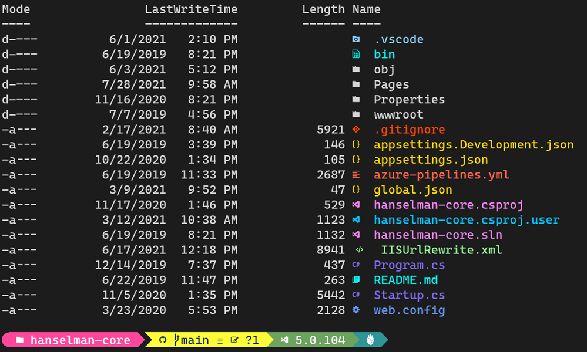

## Let's get you set up!

## GET POWERSHELL

Open a PowerShell prompt and run the following command:

```powershell
winget install JanDeDobbeleer.OhMyPosh -s winget
```

Now that Oh My Posh is installed, you can go ahead and configure your terminal and shell to get the prompt to look exactly like you want.

## Next steps :

1. install a font that supports the [`Nerd Fonts`](https://ohmyposh.dev/docs/installation/fonts)
2. install a theme from the [gallery](https://ohmyposh.dev/docs/installation/themes)
3. configure your terminal and shell to use the new font and theme

## Change your prompt

Edit your PowerShell profile script, you can find its location under the $PROFILE variable in your preferred PowerShell version. For example, using notepad:

```powershell
New-Item -Path $PROFILE -Type File -Force
```

```powershell
notepad $PROFILE
```

```powershell
oh-my-posh init pwsh | Invoke-Expression
```

## TURN YOUR POWERSHELL DIRECTORIES UP TO 11 WITH TERMINAL-ICONS

Is your prompt not extra enough? That's because your directory listing needs color AND cool icons!

```powershell
Install-Module -Name Terminal-Icons -Repository PSGallery
```

```powershell
Import-Module -Name Terminal-Icons
```

Now, open your PowerShell


