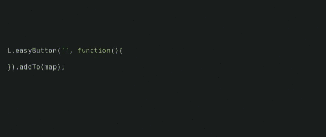

## shortly describe how to easily create

In this post, I would like to shortly describe how to easily create, style and use self-defined control button.

## L.Control.extend

We should start with extending the original class:

```javascript
var ourCustomControl = L.Control.extend({
  options: {
    position: "topleft"
    //control position - allowed: 'topleft', 'topright', 'bottomleft', 'bottomright'
  },
  onAdd: function (map) {
    return container;
  }
});
```

## onAdd

onAdd method should be now filled with definition of div, its styling and event handlers. For example:

```javascript
onAdd: function (map) {
    var container = L.DomUtil.create('div', 'leaflet-bar leaflet-control leaflet-control-custom');

    container.style.backgroundColor = 'white';
    container.style.width = '30px';
    container.style.height = '30px';

    container.onclick = function(){
      console.log('buttonClicked');
    }
    return container;
  }
```

## Adding to map

The last step is to add our control to the map:

```javascript
map.addControl(new customControl());
```

## Or see Leaflet EasyButton plugin

If you are looking for more advanced solution, you can use Leaflet EasyButton plugin. It is very easy to use and provides a lot of options. You can find it here:



https://github.com/CliffCloud/Leaflet.EasyButton
